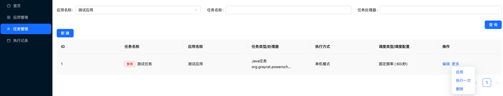

# 本地运行

> 本教程旨在帮助新用户熟悉项目和搭建本地运行环境

Power Scheduler 是一款分布式任务调度平台，支持多语言 Worker，具备高可用、易扩展、易集成等特性，适用于定时任务、批处理任务等场景的统一调度和管理。

以下为在本地开发环境快速搭建并试用 Power Scheduler 的教程：

# 第一步：初始化项目

1. 使用 `git clone` 命令下载项目代码

```
# 后端 server & worker & samples
git clone https://github.com/grayrat1999/power-scheduler.git

# 前端 web-ui
git clone https://github.com/grayrat1999/power-scheduler-console.git
```

2. 打开 `power-scheduler` 项目

3. 在 `power-scheduler` 目录下，运行下面的命令安装依赖

```
graldew dependencies
```

# 第二步：启动 Server

1. 修改 Server 端的配置文件 `power-scheduler-server/power-scheduler-server-bootstrap/src/main/application.yml`，需要修改的内容如下：

```yml
spring:
  application:
    name: power-scheduler-server
  datasource:
    # 修改数据源配置中的 url, driver-class-name, username, password
    url: jdbc:postgresql://localhost:5432/postgres
    driver-class-name: org.postgresql.Driver
    username: postgres
    password: postgres
    hikari:
      minimum-idle: 5
      maximum-pool-size: 20
      idle-timeout: 30000
      max-lifetime: 1800000
      connection-timeout: 10000
      validation-timeout: 5000
      leak-detection-threshold: 15000
      pool-name: HikariCP
  jpa:
    hibernate:
      # 修改 ddl-auto 为 update, 可以让程序启动时自动创建或者更新表结构（生产环境切勿使用）
      ddl-auto: none
    open-in-view: false
    show-sql: false

server:
  port: ${SERVER_PORT:8080}

power-scheduler-server:
  cluster-mode: ${CLUSTER_MODE:singleton}
  akka:
    host: ${AKKA_HOST:127.0.0.1}
    endpoints: ${CLUSTER_ENDPOINTS:127.0.0.1:8551,127.0.0.2:8552}
    management-http-port: ${AKKA_MANAGEMENT_PORT:8558}
    remote-port: ${AKKA_REMOTE_PORT:25258}
```

2. 在 `power-scheduler` 目录下，运行下面的命令启动 server

```
./gradlew :power-scheduler-server:power-scheduler-server-bootstrap:bootRun
```

3. 当在最新的日志中看到如下内容时，表示系统已经启动成功了

```
2025-06-01T12:59:48.240+08:00  INFO 6810 --- [power-scheduler-server] [lt-dispatcher-6] a.c.singleton.ClusterSingletonManager    : Singleton manager starting singleton actor [akka://SchedulerSystem/system/singletonManagerJobAssignorActor/JobAssignorActor]
2025-06-01T12:59:48.240+08:00  INFO 6810 --- [power-scheduler-server] [lt-dispatcher-3] a.c.singleton.ClusterSingletonManager    : ClusterSingletonManager state change [Start -> Oldest]
2025-06-01T12:59:49.255+08:00  INFO 6810 --- [power-scheduler-server] [lt-dispatcher-3] a.c.singleton.ClusterSingletonProxy      : Singleton identified at [akka://SchedulerSystem/system/singletonManagerJobAssignorActor/JobAssignorActor]
```

# 第三步：在控制台完成任务配置

1. 打开 `power-scheduler-console` 项目

2. 在 `power-scheduler-console` 目录下运行如下命令，进行服务启动

```
npm run dev
```

3. 打开 `http://localhost:5173/` 进入控制台页面并创建应用


4. 应用创建成功后，复制页面上的 `appCode` 和 `appSecret`，在系统接入时需要使用


# 第四步：业务系统接入调度服务器

这里以项目中自带的案例程序来模拟业务系统

1. 打开 `power-scheduler` 项目

2. 修改案例程序的配置文件 `power-scheduler-worker-sample/power-scheduler-worker-sample-springboot/src/main/application.yml`，需要修改的内容如下：

```yml
spring:
  application:
    name: power-scheduler-worker-sample-springboot

server:
  port: 9999

power-scheduler-worker:
  enabled: true
  # 从控制台页面上复制appCode
  app-code: demoApp
  # 从控制台页面上复制appSecret
  app-secret: yAp7nmR8i1yRG0df2mp2ZWNOpZPm325G
  # 配置Server的访问地址（如果没有改过的话，默认是127.0.0.1:8080）
  server-endpoint: ${SERVER_ENDPOINTS:127.0.0.1:8080}
  port: 7758
```

3. 在 `power-scheduler` 目录下运行下面的命令，启动业务系统

```
gradle :power-scheduler-worker-sample:power-scheduler-worker-sample-springboot:bootRun
```

4. 当最新的日志显示如下的内容时，表示系统已经在 Server 注册成功了

```
2025-06-01T13:44:50.137+08:00  INFO 9024 --- [power-scheduler-worker-sample-springboot] [pool-3-thread-1] o.g.p.worker.WorkerRegisterService       : [PowerScheduler] registered successfully
```

# 第五步：执行定时任务

1. 在业务系统的项目创建一个定时任务的处理器, 该类需要实现 `org.grayrat.powerscheduler.worker.processor.JavaProcessor` 接口，在 `JavaProcessor#process(JobContext context)` 方法中实现你的义务逻辑

```java
package org.grayrat.powerscheduler.worker.sample.springboot.processor;

import lombok.extern.slf4j.Slf4j;
import org.grayrat.powerscheduler.worker.job.JobContext;
import org.grayrat.powerscheduler.worker.processor.JavaProcessor;
import org.grayrat.powerscheduler.worker.processor.ProcessResult;
import org.springframework.stereotype.Component;

import java.util.concurrent.TimeUnit;

/**
 * @author grayrat
 * @since 2025/5/9
 */
@Slf4j
@Component
public class MyProcessor extends JavaProcessor {

    @Override
    public ProcessResult process(JobContext context) throws InterruptedException {
        log.info("job start, params={}", context.getExecuteParams());
        TimeUnit.SECONDS.sleep(60);
        log.info("job complete");
        return ProcessResult.success();
    }

}
```

2. 在控制台页面新建一个任务

注意：任务处理器 要填上一步创建类的全限定类名


3. 启用任务

任务新建成功后默认是禁用状态，建议先通过 `运行一次` 按钮来验证效果，确认无误后再开启任务



4. 任务执行记录查看


