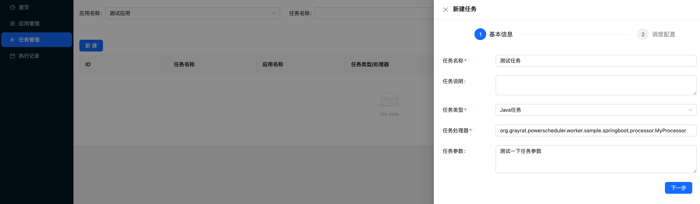
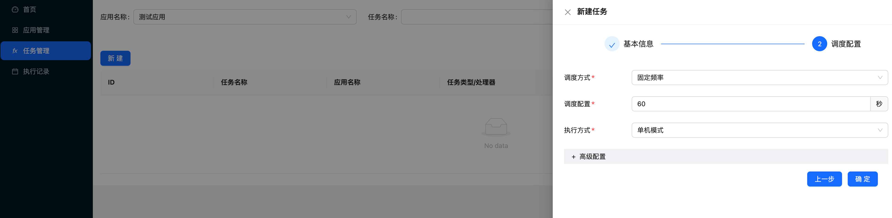
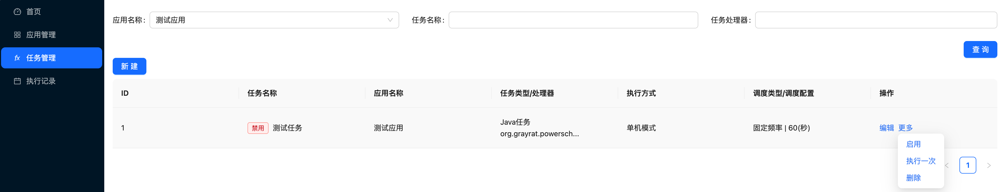
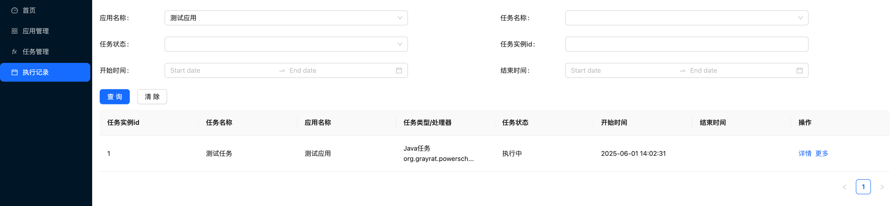

# Java 应用接入

## 前置条件

1. 使用 Java8 及以上
2. 在控制台创建应用, 获取 app-code 和 app-secret

## 系统接入

1.在你的项目中安装如下依赖（注意：版本要与 Server 相匹配）

```xml
<dependency>
  <groupId>tech.powerscheduler</groupId>
  <artifactId>power-scheduler-worker</artifactId>
  <version>${powerscheduler.version}</version>
</dependency>
```

2.在 `resources` 目录下创建配置文件 `power-scheduler-worker.properties`, 文件内容如下：

```properties
power-scheduler-worker.enabled=true
# 用户定义的应用编码, 在控制台使用该编码创建应用
power-scheduler-worker.app-code=appCode
# 在控制台创建应用后, app-secret由系统自动生成, 需要拷贝到这里
power-scheduler-worker.app-secret=2mU6Qs9OzPeKHAZSF3UlxBjfYHkgZROF
power-scheduler-worker.server-endpoint=127.0.0.1:8080
power-scheduler-worker.port=7758
# 如果服务部署在docker且使用bridge模式做了端口映射, 则需要配置external-host和external-port, 值分别为主机的ip和映射到宿主机上的端口
#power-scheduler-worker.external-host=127.0.0.1
#power-scheduler-worker.external-port=7758
```

3.编写定时任务

```java
import org.grayrat.powerscheduler.worker.job.JobContext;
import org.grayrat.powerscheduler.worker.processor.JavaProcessor;
import org.grayrat.powerscheduler.worker.processor.ProcessResult;

public class MyProcessor extends JavaProcessor {

    @Override
    public ProcessResult process(JobContext context) throws Exception {
        System.out.println("hello world!");
        return ProcessResult.success();
    }

}
```

4.在 main 方法中初始化 PowerSchedulerWorker

```java
public static void initPowerSchedulerWorker() {
    // 注册任务处理器
    ProcessorRegistry.register(new MyProcessor());
    // 读取配置文件初始化 PowerSchedulerWorker
    InputStream inputStream = ClasspathUtil.getInputStream("power-scheduler-worker.properties");
    PowerSchedulerWorkerProperties properties = PowerSchedulerWorkerProperties.load(inputStream);
    PowerSchedulerWorker powerSchedulerWorker = new PowerSchedulerWorker(properties);
    powerSchedulerWorker.init();
}

public static void main(String[] args) {
  initPowerSchedulerWorker()
}
```

## 接入验证

1. 启动服务, 如果打印下面的日志说明应用连接 Server 成功了

```
[PowerScheduler] registered successfully
```

2. 在控制台页面新建一个任务, 任务处理器填：你创建的 `Processor` 的全限定类名（例如：`tech.powerscheduler.worker.sample.springboot.processor.MyProcessor`）





3. 启用任务

任务新建成功后默认是禁用状态, 建议先通过 `运行一次` 按钮来验证效果, 确认无误后再 `启用` 任务



4. 在任务执行记录中, 可以查看任务是否成功创建


