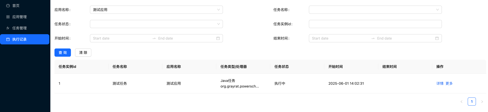

# SpringBoot 应用接入

## 前置条件

1. 使用 Java8 及以上
2. 在控制台创建应用，获取 app-code 和 app-secret

## 依赖安装

在你的项目中安装如下依赖（注意：版本要与 Server 相匹配）

```xml
<dependency>
  <groupId>tech.powerscheduler</groupId>
  <artifactId>power-scheduler-worker-spring-boot-autoconfigure</artifactId>
  <version>${powerscheduler.version}</version>
</dependency>
```

## 系统配置

```yml
power-scheduler-worker:
  enabled: true
  # 用户定义的应用编码, 在控制台使用该编码创建应用
  app-code: demoApp
  # 在控制台创建应用后, app-secret由系统自动生成, 需要拷贝到这里
  app-secret: yAp7nmR8i1yRG0df2mp2ZWNOpZPm325G
  # 配置Server的访问地址（如果没有改过的话，默认是127.0.0.1:8080）
  server-endpoint: ${SERVER_ENDPOINTS:127.0.0.1:8080}
  port: 7758
  # 如果服务部署在docker且使用bridge模式做了端口映射，则需要配置external-host和external-port，值分别为主机的ip和映射到宿主机上的端口
  # external-host: 127.0.0.1
  # external-port: 17758
```

3.编写定时任务

```java
import org.grayrat.powerscheduler.worker.job.JobContext;
import org.grayrat.powerscheduler.worker.processor.JavaProcessor;
import org.grayrat.powerscheduler.worker.processor.ProcessResult;
import org.springframework.stereotype.Component;

@Component
public class MyProcessor extends JavaProcessor {

    @Override
    public ProcessResult process(JobContext context) throws Exception {
        System.out.println("hello world!");
        return ProcessResult.success();
    }

}
```

## 接入验证

1. 启动项目，如果打印下面的日志说明应用连接 Server 成功了

```
[PowerScheduler] registered successfully
```

2. 在控制台页面新建一个任务, 任务处理器填：你创建的 `Processor` 的全限定类名（例如：`tech.powerscheduler.worker.sample.springboot.processor.MyProcessor`）


3. 启用任务

任务新建成功后默认是禁用状态，建议先通过 `运行一次` 按钮来验证效果，确认无误后再 `启用` 任务


4. 在任务执行记录中，可以查看任务是否成功创建


